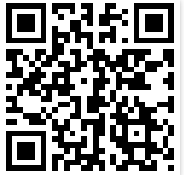

# scoreboard_tn

My flutter version of a Scoreboard application.

Version: 0.2

GH-Pages site: https://alpiepho.github.io/scoreboard_tn/

This application was built to better learn Flutter and Dart.  The world really doesn't need another simple scoring application, but attempting to duplicate how several of these common applications work, provided a way to learn many things:

- Flutter itself
- Flutter web applications as a PWA
- Learn about some of it's short commings with respect to a Google Lighthouse score
- Arranging cards
- Gesture detection and processing
- Modal dialogs
- Color Pickers
- Google fonts within Flutter
- Persistent Data
- Several other areas

These are all areas that I hope to take forward into other applications.  Flutter is fun.

## Basic Usages

The application from the above URL will open a respoonsive web page.  It is best viewed on a mobile phone with the most testing on and iPhoneX.  If opened on iPhone Safari, you can used the middle bottom button to add to the Home Screen (as a PWA).

The application opens with two large colored buttons for two teams.  Tapping either will icrement their score.  Swiping up will increment the score.  Swiping down will decrement with a limit at 0.  The Gear button will open a settings dialog.

The settings dialog allows some quick actions from icons at the top: clear scores, swap teams, and a done checkmark to save settings listed below.  All saved settings are added to the persistent storage so the next launch will read them and the user can pick up where they left off.

Other settings allow changing the team names, adjusting scores, and picking colors for the team text and background.

At the bottom are a number of predefined fonts.  These are like the top icons, and will immediately be saved.

Below are some lists of things yet to do and possible future changes.

Thanks for trying out this applications.

## Earned Points
Have you ever wanted to track the points each team really "earned", instead of what they scored?  The setting "Track earned points"
will let you do that.  This will enable second tally shown below the main score.  If you tap on that label, the score for earned
and the total points will be incremented.  These values also are shown in the Recording clipboard.

Since "earned" points correlates with "errors", and some parents get worked up about "errors", you can track the earned points and
while disabling showing the values.

NOTE: The swipe down, or delete a point, feature will currently decrement BOTH total and earned.  This may change in the future
if an intuitive gesture can be found.
## Get Application

GH-Pages site: https://alpiepho.github.io/scoreboard_tn/

or QR Code:

## Todo and Future Changes
- refactor long files
- fix settings landscape keyboard
- More fonts
- Fix more Lighthouse issues (might be in Flutter)
- Fix top bar (but it does show time etc)
- Fix no-rotation (setup but still rotates)

## Reference

Icons created with https://appicon.co/  NOTE: original image should be square to avoid white edges on IOS Home screen.

## (Original Flutter Starter README) Getting Started

This project is a starting point for a Flutter application.

A few resources to get you started if this is your first Flutter project:

- [Lab: Write your first Flutter app](https://flutter.dev/docs/get-started/codelab)
- [Cookbook: Useful Flutter samples](https://flutter.dev/docs/cookbook)

For help getting started with Flutter, view our
[online documentation](https://flutter.dev/docs), which offers tutorials,
samples, guidance on mobile development, and a full API reference.
