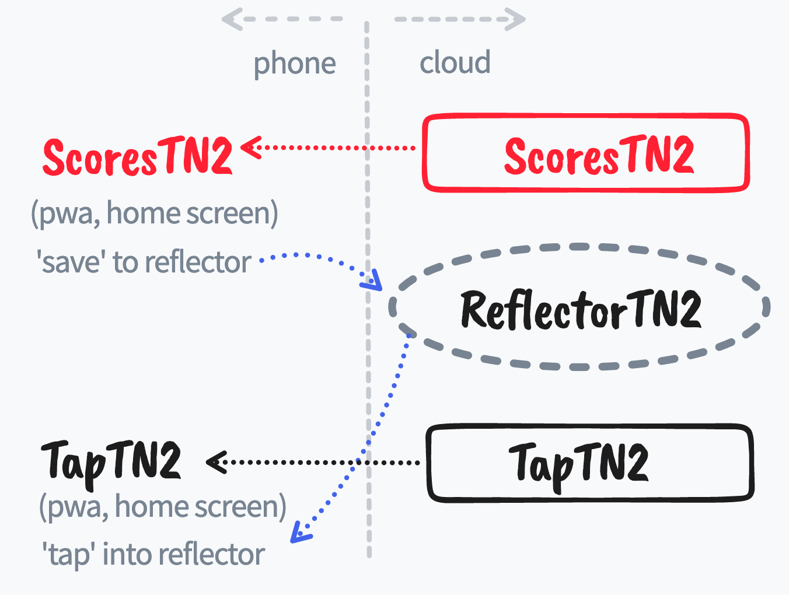
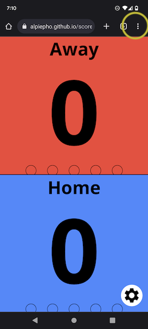
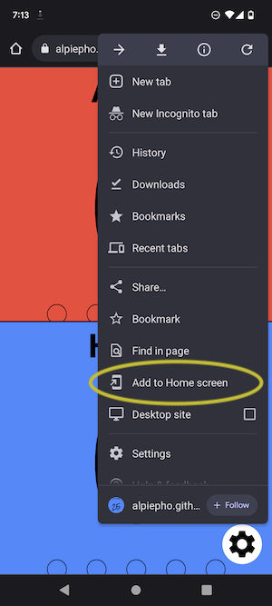
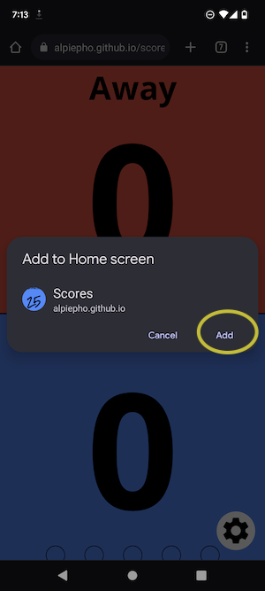
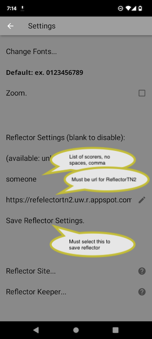

## Get Application
Version: 2.2h

GH-Pages site: https://alpiepho.github.io/scoreboard_tn2/

or QR Code:

Then see INSTALL instructions below.

## SYSTEM OVERVIEW

This application is part of a system that expands the typical scoring keeping phone application.

With other scoring applications, two problems occur:
1. The score keeper may not always show the score to video or people
2. The display on the phone may not be large enough

To solve this, there are actually 3 applications in this system:

- <u><b>ScoresTN2</b></u> - application used by score keeper
- TapTN2 - application used by parents and fans
- ReflectorTN2 - backend server to share the scores

The [ScoresTN2](https://github.com/alpiepho/scoreboard_tn2) application is similar to other
applications you can install from the Apple App Store or Google Play...but you don't need to use
either to get it!  It is a newer form of web application, a PWA, that can be opened from
a website and 'saved' to your IPhone or Android home screen.

The [TapTN2](https://github.com/alpiepho/scoreboard_tap_tn2) application is similar in style to
ScoresTN2, but only "taps' into the ReflectorTN2 site to show the scores that were recently
sent by ScoresTN2.  Again, you install it by going to the site and use options described below
to save it to your home screen.

The [ReflectorTN2](https://github.com/alpiepho/scoreboard_reflector_tn2) application is the backend
server that shares the data between the first two applicaitons.  There is no user application, but
both ScoresTN2 and TapTN2 need to be configured to use the same link to ReflectorTN2.

ScoresTN2 and TapTN2 are PWAs, Progressive Web Applications, written in Flutter. ReflectorTN2 is
a Golang application hosted on Google Cloud.  It recieves scores from ScoresTN2 and allows TapTN2 to
get them.  NOTE: the data on ReflectorTN2 is automatically deleted 1 hour after if now new scores
are recieved from ScoresTN2 for each score keeper.

FOOTNOTE: if you are wondering about "TN", it stands for "That Name"...the first words the authors
father-in-law said when his daughter told him we were getting married.  "You are going to have 'that name'?"

## INSTALL ON IPHONE

This application is a Web application known as a PWA (progressive web application).  It is possible to add a PWA to the home screen of an iPhone
like it is a downloaded application. Use the following steps:

NOTE: images are from Scores app, but still illustrate the process.

1. Open the above link in Safari and click on up-arrow

2. Click on "Add to Home Screen"

3. Select "Add"

## INSTALL ON ANDROID

This application is a Web application known as a PWA (progressive web application).  It is possible to add a PWA to the home screen of an Android phone
like it is a downloaded application. Use the following steps:

NOTE: images are from Scores app, but still illustrate the process.

1. Open the above link in Chrome and click on '...'

2. Click on "Add to Home Screen"

3. Select "Add"

## KNOWN ISSUES WITH A PWA

A PWA on iPhone or Android requires internet access to launch the first time.  However, once it is running, the application will work fine without and an internet connection.

## BASIC USAGE - ScoresTN2

The application from the above URL will open a respoonsive web page.  It is best viewed on a mobile phone with the most testing on and iPhoneX.  If opened on iPhone Safari, you can used the middle bottom button to add to the Home Screen (as a PWA).

The application opens with two large colored buttons for two teams.  Tapping either will icrement their score.  Swiping up will increment the score.  Swiping down will decrement with a limit at 0.  The Gear button will open a settings dialog.

The settings dialog allows some quick actions from icons at the top: clear scores, swap teams, and a done checkmark to save settings listed below.  All saved settings are added to the persistent storage so the next launch will read them and the user can pick up where they left off.

The settings dialog also allows selecting the reflector server and which score keeper
to track. (Image is from TapTN2, but settings section is the same for ScoresTN2)

Other settings allow changing the team names, adjusting scores, and picking colors for the team text and background.

At the bottom are a number of predefined fonts.  These are like the top icons, and will immediately be saved.

Below are some lists of things yet to do and possible future changes.

Thanks for trying out this applications.

## TODO AND FUTURE CHANGES
- [x] debug painting
- [x] faster draw after rotate?
- [x] fix rotate
- [x] refactor long files
- [-] refactor settings modal (from bottom?)
- [x] track sets
- [x] better contrast?, bigger mode (no team name?)
- [ ] getter offline, without first access?

- [x] ways to share score better?
- [x] reflector settings
- [-] verify settings
- [x] call reflector
- [x] fix persist settings or move to team? or save reflector
- [-] move time stamp here
- [x] add dialog for comments
- [x] send comments to refector
- [x] handle comments in reflector
- [-] size 13
- [x] saving existing keeper syncs data

- [ ] style for alert dialogs (scores app only?)
- [ ] refactor duplicate code sections
- [ ] fix engine save/get, add version check

- [ ] mic to annotate?
- [ ] remote BT device?

- [ ] More fonts
- [ ] Run Lighthouse

## APPENDIX: How to outline Repaint

<pre>
void main() {
  // --> debugRepaintRainbowEnabled = true;
  runApp(Scoreboard());
}
</pre>

## APPENDIX: Ideas to prevent rotate

https://code-boxx.com/lock-screen-orientation/

https://stackoverflow.com/questions/3501510/blocking-device-rotation-on-mobile-web-pages

## REFERENCES

Icons created with https://appicon.co/  NOTE: original image should be square to avoid white edges on IOS Home screen.

QR code generated with https://www.the-qrcode-generator.com/.  Used screen capture to save qrocode.png and copied file here.

- https://github.com/alpiepho/scoreboard_tn2
- https://github.com/alpiepho/scoreboard_reflector_tn2
- https://github.com/alpiepho/scoreboard_tap_tn2

